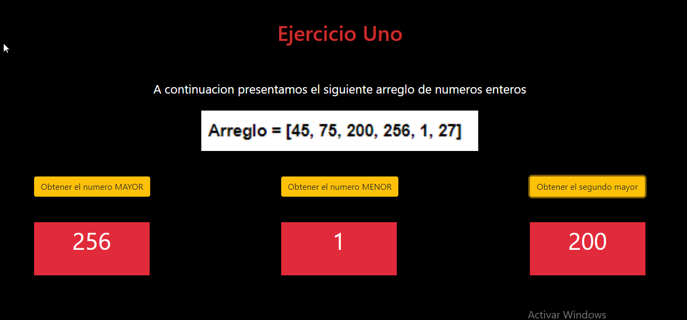

# RETO UNO

Dado el siguiente arreglo :

```Arreglo = [45, 75, 200, 256, 1, 27]```

Desarrollar el código para cada uno de los siguientes casos:

1. Obtener el número mayor del arreglo.

2. Obtener el número menor del arreglo.

3. Obtener el segundo número mayor del arreglo.



## Herramientas Tecnológicas

* HTML 5

* CSS 3

* Javascript

## Desarrollado por 

  Nefeli Joñoruco Morales 
  
## Desarrollado para

[El Comercio](https://elcomercio.pe/)


